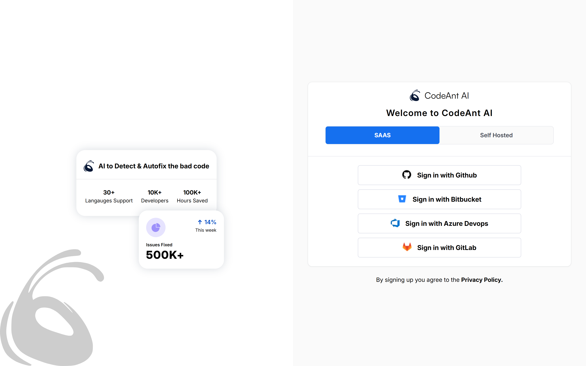
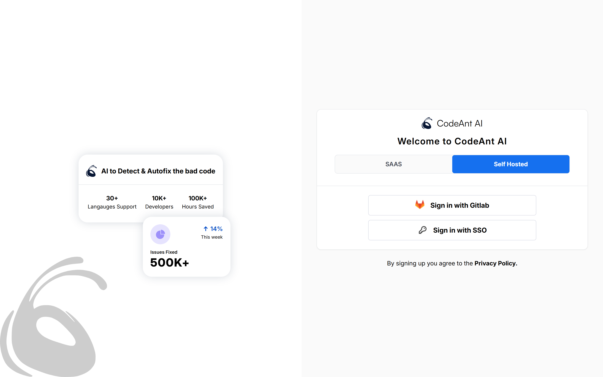
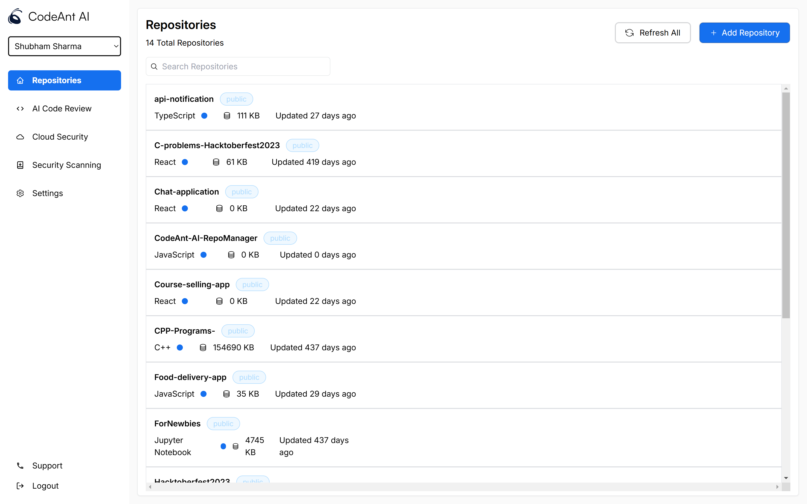
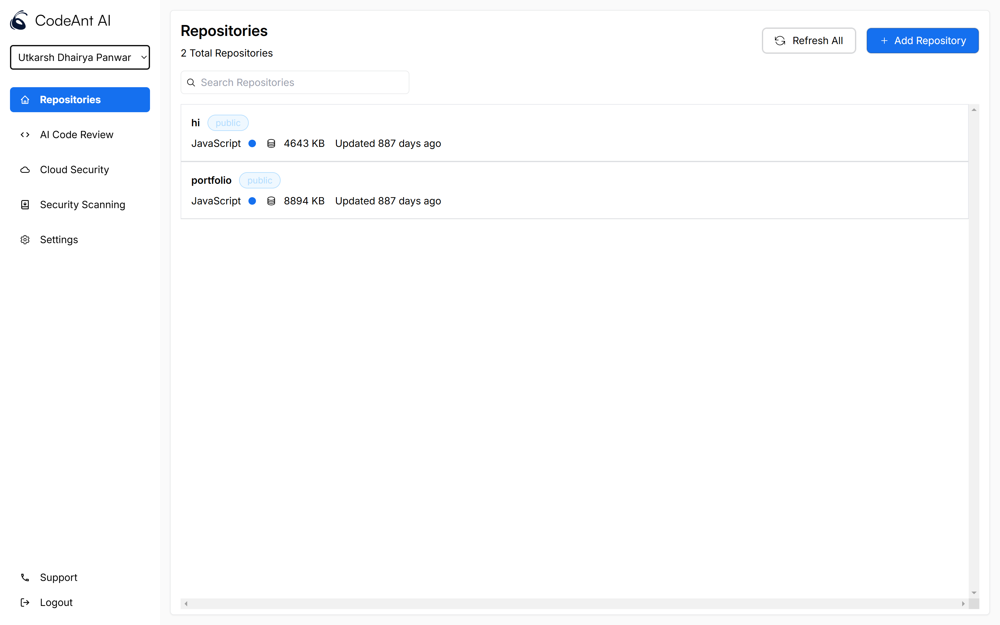
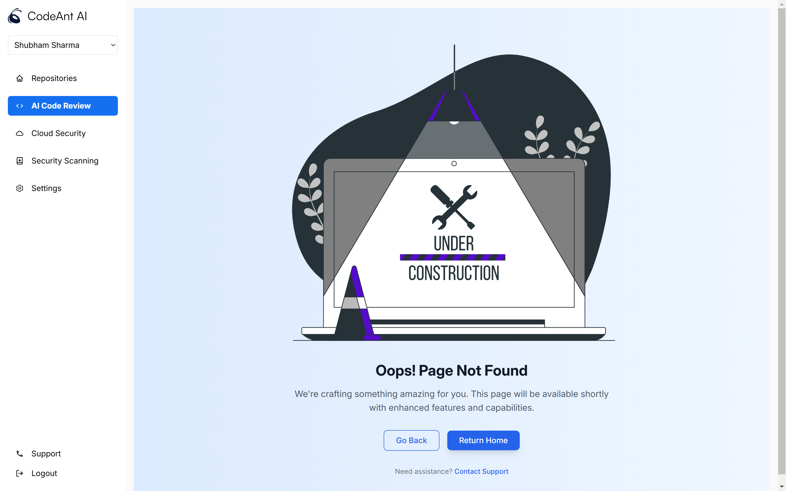

# CodeAnt AI - RepoManager

CodeAnt AI RepoManager is a modern web application built with React that helps developers manage and analyze their GitHub repositories efficiently. It provides an intuitive interface for repository management, code analysis, and collaboration.

### Live Demo
🚀 [Check out CodeAnt AI RepoManager](https://codeant-ai-repo-manager.vercel.app/login)

## Features


- **Seamless Authentication**
  - Dual authentication support (SAAS & Self-hosted)
  - Secure user sessions
  - Privacy-focused design

- **Repository Management**
  - Real-time repository search and filtering
  - Quick repository refresh
  - Repository metrics visualization
  - Intuitive repository listing

- **Modern UI/UX**
  - Clean and responsive design
  - Dark/light mode support
  - Mobile-friendly interface
## Tech Stack

- **Frontend Framework**: React 18.x
- **Routing**: React Router DOM
- **Styling**: 
  - Tailwind CSS
  - Radix UI Components
- **Build Tool**: Vite
- **API**: Github API


## Run Locally

Clone the project

```bash
  git clone https://github.com/shubhamsharma-10/CodeAnt-AI-RepoManager.git
```

Go to the project directory

```bash
  cd my-project
```

Install dependencies

```bash
  npm install
```

Start the server

```bash
  npm run start
```

Open the application in browser:

```bash
  http://localhost:5173
```


## Available Scripts

To run tests, run the following command

- npm run dev - Starts the development server
- npm run build - Creates a production build
- npm run lint - Runs ESLint for code quality checks
- npm run preview - Previews the production build locally


## Project Structure

```
codeant-ai-repomanager/
├── src/
│   ├── components/
│   │   ├── AuthForm.jsx
│   │   ├── AuthPlaceholder.jsx
│   │   ├── Authentication.jsx
│   │   └── Sidebar.jsx
│   ├── pages/
│   │   ├── Auth.jsx
│   │   ├── Home.jsx
│   │   └── NotFound.jsx
│   ├── App.jsx
│   └── main.jsx
├── public/
│   ├── icons/
│   └── output/
├── config/
│   ├── components.json
│   ├── tailwind.config.js
│   └── vite.config.js
└── package.json
```
## 📷 Application Screenshots

### User Authentication
###  1. SAAS Login


### 2. Self-Hosted Login


### Main Dashboard




### Page Under Development


### 🤝 Connect with me:

Feel free to connect with me on [LinkedIn](https://www.linkedin.com/in/shubhamsharma1004/).
